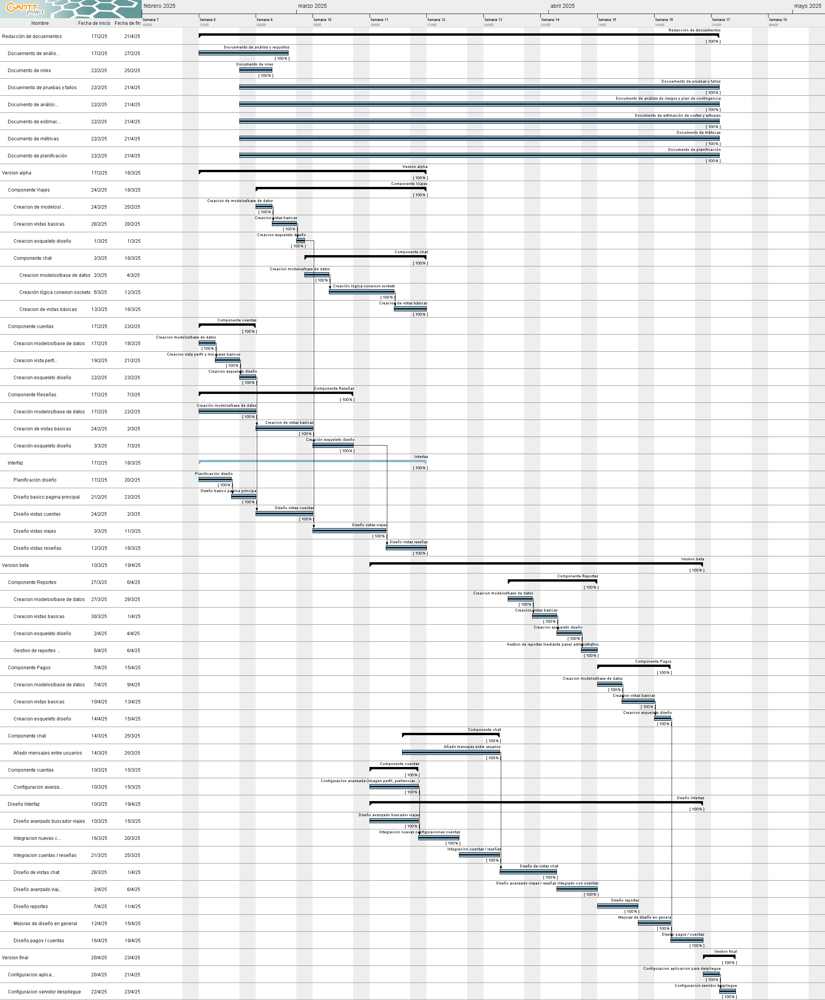

# CharlaCar - Plataforma de Viajes Compartidos


## Descripción
CharlaCar es una plataforma que permite viajar de manera barata. Permite conectar a personas que quieren rentabilizar un viaje y a otras que quieren viajar de manera cómoda y económica. A través de CharlaCar, los conductores pueden publicar sus viajes y ofreces plazas en sus vehículos, mientras que los pasajeros pueden buscar y reservar estos viajes.

## Caractrísticas principales

- **Publicación y búsquda de viajes**: Los usuarios pueden publicar trayectos o buscar viajes disponibles.
- **Perfiles de usuario**: Sistema de registro, autenticacion y perfiles personalizables.
- **Reserva plazas**: Posibilidad de reservar asientos en viajes publicados.
- **Chat en tiempo real**: Intercambio de mensajes en tiempo real entre usuarios.
- **Sistema de pagos**: Sistema de envío seguro entre usuarios dentro de la plataforma.
- **Sistema de reseñas**: Sistema de reputación entre usuarios.
- **Informes y estadisticas**: ...

## Tecnologías usadas

### Backend

- **Python**: Lenguaje de programación principal
- **Django**: Framework web de alto nivel para desarrollo rápido
- **SQLite**: Base de datos para entorno de desarrollo
- **MYSQL**: Base de datos para producción.
- **Daphne**: Servidor ASGI para manejo de WebSockets y HTTP

### Frontend

- **HTML5/CSS3**: Estructura y estilos de la interfaz de usuario
- **JavaScript**: Funcionalidades interactivas en el lado del cliente
- **FontAwesome**: Iconografía para la interfaz de usuario

## Desarrollo

El siguiente diagrama muestran la planificación del proyecto:



## Instalación

### Requisitos previos
- Python 3.13.3 (en caso de otra versión los paquetes de requirements.txt podrían usar versiones diferentes).
- pip
- Virtualenv (recomendado)

### Pasos de instalación

1. Clonar el repositorio:
   ```
   git clone https://github.com/alejandroGM0proyecto_software.git
   ```

2. Crear y activar entorno virtual:
   ```
   python -m venv env
   # En Windows
   env\Scripts\activate
   # En macOS/Linux
   source env/bin/activate
   ```

3. Instalar dependencias:
   ```
   pip install -r requirements.txt
   ```

4. Crear migraciones:
   ```
   python codigo/manage.py migrate
   ```

5. Realizar migraciones:
   ```
   python codigo/manage.py makemigrations
   ```
5. Crear superusuario:
   ```
   python codigo/manage.py createsuperuser
   ```
5. Ejecutar:
```
   python -m daphne -p 8000 blablacar.asgi:application
```

## Configuración de variables de entorno

Antes de ejecutar el proyecto, copia el archivo `.env.example` como `.env` en la raíz del proyecto y personaliza los valores según tu entorno:

```bash
cp .env.example .env
```

## Flujo de desarrollo recomendado

1. Para el desarrollo rapido y con cambios en tiempo real sin todas las funcionalidades de la aplicacion:
```bash
python .\manage.py runserver
```
2. Para el desarrollo con todas las funcionalidades de la aplicacion:
```bash
python -m daphne -p 8000 blablacar.asgi:application
```

## Ejecución de tests

Para ejecutar todos los tests del proyecto:
```bash
python manage.py test
```

Para ejecutar tests de una aplicación específica:
```bash
python manage.py test nombre_app
```

Para ejecutar un módulo de test específico:
```bash
python manage.py test nombre_app.tests.test_module
```


Para ejecutar un método de test específico:
```bash
python manage.py test nombre_app.tests.test_module.NombreClaseTest.test_metodo
```

# Generador de Datos de Prueba para CharlaCar

Este comando de gestión de Django genera datos de prueba aleatorios.
## Uso

Para generar datos de prueba, ejecute:

```bash
python manage.py generate_test_data
```

### Opciones disponibles

- `--users NUMBER`: Número de usuarios a crear (por defecto: 20)
- `--rides NUMBER`: Número de viajes a crear (por defecto: 50)
- `--chats NUMBER`: Número de chats a crear (por defecto: 30)
- `--messages NUMBER`: Número de mensajes a crear (por defecto: 200)
- `--reports NUMBER`: Número de reportes a crear (por defecto: 25)
- `--payments NUMBER`: Número de pagos a crear (por defecto: 40)
- `--clean`: Elimina todos los datos existentes antes de generar nuevos datos

### Ejemplos

Generar datos con los valores predeterminados:
```bash
python manage.py generate_test_data
```

Generar un conjunto más grande de datos:
```bash
python manage.py generate_test_data --users 100 --rides 200 --messages 1000
```

Limpiar la base de datos y generar un pequeño conjunto de datos:
```bash
python manage.py generate_test_data --clean --users 10 --rides 20
```

## Estructura del proyecto

```
charlacar/
├── codigo/
│   ├── accounts/       # Gestión de usuarios y perfiles
│   ├── blablacar/      # Configuración principal del proyecto
│   ├── chat/           # Sistema de mensajería
│   ├── payments/       # Procesamiento de pagos
│   ├── reports/        # Generación de informes
│   ├── reviews/        # Sistema de valoraciones
│   ├── dashboard/      # Panel de administración
│   ├── rides/          # Gestión de viajes
│   ├── static/         # Archivos estáticos
│   ├── templates/      # Plantillas HTML globales
│   └── manage.py       # Utilidad de gestión de Django
└── documentacion/      # Documentación del proyecto
```